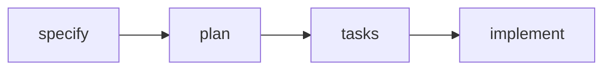

<!--
author: Andrea Charão
title: Primeiros passos com Spec Kit
language: pt
comment: Anotações sobre o uso do Spec Kit para iniciar uma aplicação simples.
import: https://raw.githubusercontent.com/LiaTemplates/mermaid_template/0.1.4/README.md
-->

[](https://liascript.github.io/course/?https://raw.githubusercontent.com/AndreaInfUFSM/sdd-hands-on/main/docs/README-01-speckit.md)


# Primeiros passos com Spec Kit

Um registro sobre o que aprendi ao usar o **Spec Kit** para iniciar uma aplicação simples.


---

## Spec Kit

**Spec Kit** é um toolkit do GitHub para apoiar **desenvolvimento guiado por especificações** (*Spec-Driven Development*).

Em vez de começar escrevendo código diretamente, o fluxo começa pela **descrição estruturada** do que deve ser construído:



Na prática, isso ajuda a transformar uma conversa com um agente de IA em um processo um pouco mais organizado (menos vibe coding).

Links úteis:

- [Documentação oficial](https://github.github.com/spec-kit/)
- [Repositório no GitHub](https://github.com/github/spec-kit)


---

## Usando o Spec Kit

Para usar o Spec Kit, é preciso:

- instalar ou executar o comando `specify` para criar um projeto
- usar comandos do Spec Kit dentro do projeto para instruir um agente de IA 

Ver mais detalhes na sequência.

### Dependências 

- `git` (porque Spec Kit assume que o projeto em desenvolvimento está em um repositório Git)
- `uv` ou `pipx` (para instalação)
- um agente de IA compatível, como Copilot, Claude, Gemini, Codex, Cursor, entre outros

### Instalação e inicialização

Instalação persistente:

```bash
uv tool install specify-cli --from git+https://github.com/github/spec-kit.git@vX.Y.Z
```

Depois:

```bash
specify init meu-projeto --integration copilot
```

Sem instalação persistente (baixar e executar em um mesmo comando):

```bash
uvx --from git+https://github.com/github/spec-kit.git specify init meu-projeto
```

### Integrações

O Spec Kit pode gerar comandos, scripts e arquivos de contexto para diferentes agentes.

Exemplos:

```bash
specify init meu-projeto --integration copilot
specify init meu-projeto --integration claude
specify init meu-projeto --integration gemini
specify init meu-projeto --integration codex
```

### Comandos mínimos

| Comando | Para que serve |
|---|---|
| `/speckit.specify` | Descreve o que será construído |
| `/speckit.plan` | Define escolhas técnicas e arquitetura |
| `/speckit.tasks` | Quebra o plano em tarefas |
| `/speckit.implement` | Executa as tarefas e gera/modifica código |


Fluxo um pouco mais cuidadoso:

```text
/speckit.constitution
/speckit.specify
/speckit.clarify
/speckit.checklist
/speckit.plan
/speckit.tasks
/speckit.analyze
/speckit.implement
```

## Experiência neste repositório

- App "Desafio do Dia" para estudantes de Paradigmas de Programação
- O fluxo de trabalho com `/speckit.specify` seria descrever uma primeira especificação de requisitos em forma de um prompt/chat
- No entanto, seria um prompt longo e, para aproveitá-lo em outras experiências, achei melhor colocar os requisitos em um arquivo, gerado com ChatGPT
- Arquivo com requisitos: [shared/requirements/challenge-of-the-day-app.md](shared/requirements/challenge-of-the-day-app.md)
- Usei `/speckit.specify` com instruções para ler o documento de requisitos como entrada 

### Primeira rodada do workflow

- Pasta [01-speckit/specs/001-challenge-of-the-day-app/](01-speckit/specs/001-challenge-of-the-day-app/)
- Arquivo [spec.md](01-speckit/specs/001-challenge-of-the-day-app/spec.md)
- Arquivo [plan.md](01-speckit/specs/001-challenge-of-the-day-app/plan.md)
- Arquivo [tasks.md](01-speckit/specs/001-challenge-of-the-day-app/tasks.md)
- Implementação (código gerado pelo agente)

  - [frontend](01-speckit/frontend/)
  - [backend](01-speckit/backend/)

- **Reflexão**: Bom início de implementação, mas resultado um pouco distante do desejado. Especificação poderia ter dado mais ênfase no estilo do frontend.

### Segunda rodada do workflow

- Geração de alternativas de frontend por fora do Spec Kit

- Pasta [frontend-playground](01-speckit/frontend-playground/)

- Uma vez escolhida a melhor alternativa de design do frontend, a ideia era integrar os arquivos à versão anterior, preservando algumas partes e alterando outras 

- Criei uma spec separada para fazer a integração: https://github.com/AndreaInfUFSM/sdd-hands-on/tree/9d451212b8269ec4b6012d7da486ccbfc204117e/specs

- **Reflexão**: Resultado não foi o esperado, pois acabou sendo gerada outra aplicação. Isso provavelmente poderia ter sido notado antes de terminar todo o fluxo, examinando os documentos intermediários gerados 

### Conclusão

- Primeira rodada do fluxo é simples, embora possa demorar para executar
- Rodadas subsequentes do fluxo exigem mais atenção
- Particularidade do SpecKit: 

  - muito sensível à localização da pasta .git, o que exigiu uma gambiarra neste repositório sdd-hands-on, que já tinha uma pasta .git (tive que criar um subrepo não rastreado para inicializar o SpecKit, depois remover o .git que ele cria)
  - uso mais natural: inicializar o SpecKit na raiz de um repositório

