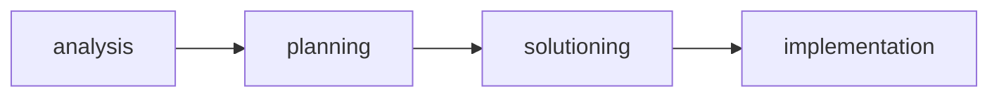

<!--
author: Andrea Charão
title: Primeiros passos com BMAD Method
language: pt
comment: Anotações sobre o uso do BMAD Quick com OpenCode para iniciar uma aplicação simples.
import: https://raw.githubusercontent.com/LiaTemplates/mermaid_template/0.1.4/README.md
-->

[](https://liascript.github.io/course/?https://raw.githubusercontent.com/AndreaInfUFSM/sdd-hands-on/main/docs/README-03-bmad-quick.md)


# Primeiros passos com BMAD 

Um registro sobre o que aprendi ao usar o **BMAD** com **OpenCode** para iniciar uma aplicação simples.


## BMAD


**BMAD Method** é um framework para apoiar o **desenvolvimento de software com agentes de IA**, combinando planejamento, especificação, arquitetura e implementação guiada.

BMAD organiza o trabalho como um fluxo com **papéis especializados**: alguns agentes ajudam a entender o problema e produzir artefatos de planejamento; outros agentes ajudam a transformar esses artefatos em histórias, tarefas e código. 



Na prática, o BMAD ajuda a transformar uma ideia inicial em documentos e etapas de desenvolvimento, usando agentes como analista, gerente de produto, arquiteto, scrum master, desenvolvedor e QA.

Links úteis:

- Documentação oficial: https://docs.bmad-method.org/
- Repositório no GitHub: https://github.com/bmad-code-org/BMAD-METHOD


## Quick vs Full

- A documentação do BMAD distingue alguns fluxos de trabalho que se aplicam a diferentes contextos

- O que é chamado de **BMAD Quick** (ou `/bmad-quick-dev`) é um processo considerado mais curto, recomendável para aplicações de pequeno porte, ou para aplicações que já têm alguma especificação bem formada, ou talvez para quando se quer economizar o uso de agentes (interpretação própria). O fluxo todo provavelmente executa mais rápido que o fluxo full.


- O que é chamado de **BMAD Full** é um processo considerado mais completo, recomendável quando não se tem uma especificação clara ou quando se deseja refinar a análise de um problema antes das outras etapas. Também é um processo que vai executar mais etapas após a implementação (geração do código). Provavelmente é o mais adequado para aplicações de maior porte, e por tudo isso é esperado que o fluxo demore mais para executar.


## Usando o BMAD

Para usar o BMAD nesta experiência, o fluxo básico foi:

- inicializar o OpenSpec no projeto
- selecionar a ferramenta/agente a ser usada
- abrir o agente no terminal do VS Code
- copiar um arquivo de requisitos para a área de especificações (isso para manter a especificação inicial idêntica à usada com outros frameworks de SDD)
- pedir ao agente para propor, aplicar e arquivar a mudança


### Dependências


- `node`/`npm`, para instalação do OpenSpec quando necessário
- `openspec`, para inicializar e manter os artefatos de especificação
- Um gerenciador de agentes, por exemplo opencode

Opcionais/seleções usados:

- `opencode`, usado nesta experiência como agente no terminal
- `git`, porque o trabalho faz mais sentido em um repositório versionado
- VS Code, usado como ambiente de trabalho


### Instalação e Inicialização

- Instalação e inicialização ocorrem no mesmo comando, dentro da pasta onde se deseja construir o projeto
- Opcional: instalar OpenCode (ou outro agente suportado)
- Processo de instalação é o mesmo para BMAD Quick ou Full. O que muda vão ser os comandos pós instalação/inicialização


#### OpenCode

Instalação:

```bash
curl -fsSL https://opencode.ai/install | bash
```


#### BMAD

Instalação deve ser dentro da pasta do projeto:

```bash
cd 03-bmad-quick
npx bmad-method install 
```


Durante a inicialização:

- `[Enter]` para escolher a ferramenta
- `[Space]` para selecionar `opencode`

Pastas criadas:

```text
_bmad
_bmad_output
docs
openspec/
.agents/
.opencode/
```

## Comandos mínimos

Os comandos podem variar conforme a integração escolhida. 


No uso com **OpenCode**, o BMAD pode aparecer mais como **skills/agentes** do que como comandos de barra.

| Comando / skill | Para que serve |
|---|---|
| `bmad-help` | Mostra ajuda sobre o BMAD, agentes disponíveis e formas de uso |
| `bmad-quick-dev` | Executa um fluxo mais direto para mudanças pequenas, correções ou implementação a partir de requisitos já definidos |


Outros comandos / skills:

| Comando / skill | Para que serve |
|---|---|
| `bmad-orchestrator` | Coordena o uso dos agentes e ajuda a escolher o próximo passo do fluxo BMAD |
| `bmad-analyst` | Ajuda a entender o problema, levantar requisitos e organizar ideias iniciais |
| `bmad-pm` | Apoia a criação de documentos de produto, escopo e prioridades |
| `bmad-architect` | Apoia decisões de arquitetura e estrutura técnica |
| `bmad-dev` | Implementa tarefas ou histórias já preparadas |
| `bmad-qa` | Revisa a solução, identifica problemas e sugere melhorias |


---

## Experiência neste repositório

- App **Desafio do Dia** para estudantes de Paradigmas de Programação
- Objetivo: criar uma primeira versão da aplicação a partir de requisitos já documentados
- Agente usado: `opencode`
- Ferramenta de SDD: `bmad`
- Ambiente: terminal do VS Code

### Primeira rodada do workflow

Passos realizados:

1. Instalei e inicializei o BMAD na pasta existente (03-bmad-quick):

   ```bash
   cd examples/03-bmad-quick
   npx bmad-method install
   ```

2. Seleção de módulos (somente o básico/default):

   ```text
    │  Selected official modules:
    │    • BMad Method (v6.8.0)
    │    • BMad Core Module (v6.8.0)
   ```

3. Seleção da integração (OpenCode):

   ```text
    ◇  Integrate with:
    │  1 items selected
    │
    │  Selected tools:
    │    • OpenCode
   ```

3. Verifiquei as pastas criadas:

   ```text
   .opencode/
   .agents/
   _bmad/
   _bmad_output/
   docs
   ```

4. Abri o agente no terminal do VS Code:

   ```bash
   opencode
   ```

5. Copiei o arquivo de requisitos do app para dentro da pasta `docs`.

6. Pedi a criação da primeira versão do app:

   ```text
   /bmad-quick-dev Read docs/challenge-of-the-day-app.md and use BMAD quick development flow to implement the first version of the Challenge of the Day app
   ```

7. Aguardei pacientemente com curiosidade


### Reflexões / Conclusão

Diferenças em relação aos processos anteriores (01-speckit e 02-openspec):

- Usei o mesmo agente (OpenCode + Big Pickle) que usei com OpenSpec
- Sem tempo para uma segunda rodada, nem inspeção do código gerado

Reflexões e observações:

- Processo foi mais lento que com OpenSpec, mas mais rápido do que com SpecKit (vale lembrar que tanto o agente como o framework impactam nesse tempo)
- Assim como OpenSpec, BMAD também não interfere (ou se importa) no versionamento com git, ao contrário do SpecKit
- Quantidade de artefatos/documentação gerados é grande, provavelmente o maior dos 3 frameworks, mesmo para o processo Quick

